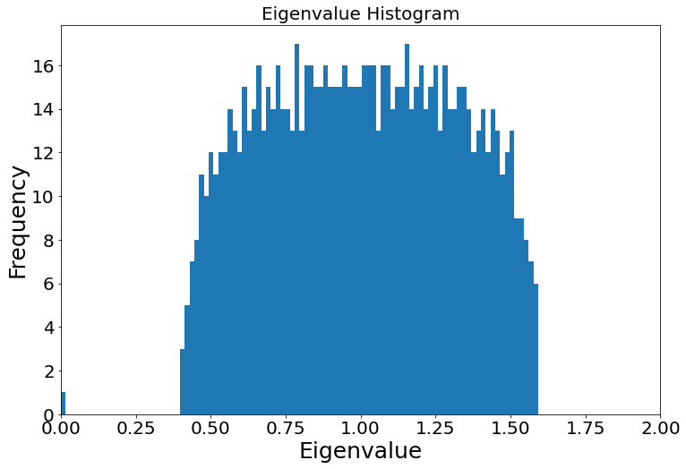

# 图机器学习NetworkX代码实战


```python
import pandas as pd
import numpy as np
import matplotlib as mpl
```


```python
import networkx as nx
nx.__version__
```


    '2.6.3'


```python
import matplotlib
import matplotlib.pyplot as plt
%matplotlib inline
matplotlib.rc("font",family='SimHei') # 中文字体
plt.rcParams['axes.unicode_minus']=False  # 用来正常显示负号
plt.rcParams['font.sans-serif']=['SimHei']
```

## 创建NetworkX内置图


```python
n = 5
graph_types = ['全连接无向图','全连接有向图','环状图','梯状图','线性串珠图','星状图','轮辐图','二项树',
              '二维矩形网格图','多维矩形网格图','二维三角形网格图','二维六边形蜂窝图','n维超立方图','随机图',
              '无标度有向图','空手道俱乐部数据集']
graph_funcs = [nx.complete_graph(n),nx.complete_graph(n,nx.DiGraph()),nx.cycle_graph(n),
               nx.ladder_graph(n),nx.path_graph(n),nx.star_graph(n),nx.wheel_graph(n),
              nx.binomial_tree(n),nx.grid_2d_graph(n,n),nx.grid_graph(dim=(n,n,n)),
              nx.triangular_lattice_graph(n,n),nx.hexagonal_lattice_graph(n,n),nx.hypercube_graph(n),
              nx.erdos_renyi_graph(n,0.5),nx.scale_free_graph(100),nx.karate_club_graph()]
fig, axes = plt.subplots(4, 4,figsize=(20,20))
axes_list = []
for i in range(axes.shape[0]):
    for j in range(axes.shape[1]):
        axes_list.append(axes[i, j])
i = 0
for ax in axes_list:
    ax.set_title(graph_types[i])
    nx.draw(graph_funcs[i],ax=ax,with_labels=False)
    i += 1
```


### 更多内置图

nx.diamond_graph() 
nx.bull_graph() 
nx.frucht_graph() 
nx.house_graph() 
nx.house_x_graph() 
nx.petersen_graph() 
nx.krackhardt_kite_graph()

## 连接表和邻接表创建图

数据来源：http://www.openkg.cn/dataset/ch4masterpieces


```python
df = pd.read_csv('triples.csv')
df.head()
```

<table border="1" class="dataframe">
  <thead>
    <tr style="text-align: right;">
      <th></th>
      <th>head</th>
      <th>tail</th>
      <th>relation</th>
      <th>label</th>
    </tr>
  </thead>
  <tbody>
    <tr>
      <th>0</th>
      <td>关羽</td>
      <td>刘备</td>
      <td>younger_sworn_brother</td>
      <td>义弟</td>
    </tr>
    <tr>
      <th>1</th>
      <td>张飞</td>
      <td>刘备</td>
      <td>younger_sworn_brother</td>
      <td>义弟</td>
    </tr>
    <tr>
      <th>2</th>
      <td>关羽</td>
      <td>张飞</td>
      <td>elder_sworn_brother</td>
      <td>义兄</td>
    </tr>
    <tr>
      <th>3</th>
      <td>张苞</td>
      <td>张飞</td>
      <td>son</td>
      <td>儿子</td>
    </tr>
    <tr>
      <th>4</th>
      <td>关兴</td>
      <td>关羽</td>
      <td>son</td>
      <td>儿子</td>
    </tr>
  </tbody>
</table>
</div>


### 通过连接表Edge List创建图


```python
G = nx.DiGraph()
edges = [edge for edge in zip(df['head'],df['tail'])]
G.add_edges_from(edges)
```


```python
pos = nx.spring_layout(G,seed=123)
plt.figure(figsize=(15,15))
nx.draw(G,pos=pos,with_labels=True)
```


    


### 创建无节点、无连接的空图


```python
G = nx.Graph()
G.add_node('刘备')
G.add_node('Tommy')
G.add_node(1)
G.add_nodes_from(['诸葛亮','曹操'])
G.add_nodes_from(range(100,105))
```

### 添加带属性特征的节点


```python
G.add_nodes_from([
    (('关羽',{'武器':'青龙偃月刀','武力值':90,'智力值':80})),
    (('张飞',{'武器':'丈八蛇矛','武力值':85,'智力值':75})),
    (('吕布',{'武器':'方天画戟','武力值':100,'智力值':70})),
])
```


```python
print(G.nodes)
nx.draw(G)
```

    ['刘备', 'Tommy', 1, '诸葛亮', '曹操', 100, 101, 102, 103, 104, '关羽', '张飞', '吕布']


    


### 创建另一个首尾相连成串的Path Graph


```python
H = nx.path_graph(10)
print(H.nodes)
nx.draw(H)
```

    [0, 1, 2, 3, 4, 5, 6, 7, 8, 9]


    


### 将H的节点添加到G中


```python
G.add_nodes_from(H)
print(G.nodes(data=True))
nx.draw(G)
```

    [('刘备', {}), ('Tommy', {}), (1, {}), ('诸葛亮', {}), ('曹操', {}), (100, {}), (101, {}), (102, {}), (103, {}), (104, {}), ('关羽', {'武器': '青龙偃月刀', '武力值': 90, '智力值': 80}), ('张飞', {'武器': '丈八蛇矛', '武力值': 85, '智力值': 75}), ('吕布', {'武器': '方天画戟', '武力值': 100, '智力值': 70}), (0, {}), (2, {}), (3, {}), (4, {}), (5, {}), (6, {}), (7, {}), (8, {}), (9, {})]


    


### 将H本身作为一个节点添加到G中


```python
G.add_node(H)
print(G.nodes)
nx.draw(G)
```

    ['刘备', 'Tommy', 1, '诸葛亮', '曹操', 100, 101, 102, 103, 104, '关羽', '张飞', '吕布', 0, 2, 3, 4, 5, 6, 7, 8, 9, <networkx.classes.graph.Graph object at 0x7f931cccb450>]


    


### Tips
节点可以为任意可哈希的对象，比如字符串、图像、XML对象，甚至另一个Graph、自定义的节点对象。
通过这种方式，你可以根据你的应用，自由灵活地构建：图为节点、文件为节点、函数为节点，等灵活的图形式。

### 创建连单个连接，设置属性特征


```python
G = nx.Graph()
G.graph['Name'] = 'HelloWorld'
G.add_edge(0,1,weight=0.5,like=3)
```

### 创建多个连接


```python
G.add_edges_from([
    (1,2,{'weight':0.3,'like':5}),
    (2,0,{'weight':0.1,'like':8})
])
```


```python
nx.draw(G,with_labels=True)
```


    


### 全图连接信息


```python
G.number_of_edges()
```


    3


```python
G.edges(data=True)
```


    EdgeDataView([(0, 1, {'weight': 0.5, 'like': 3}), (0, 2, {'weight': 0.1, 'like': 8}), (1, 2, {'weight': 0.3, 'like': 5})])


### nx.draw可视化


```python
G = nx.grid_2d_graph(4,4)
pos = nx.spring_layout(G,seed=123)
```

#### 原生可视化


```python
nx.draw(
    G,
    pos,
    node_color='#A0CBE2', # 节点颜色
    edgecolors='red', # 节点外边缘的颜色
    edge_color='blue', # edge的眼神
    edge_cmap = plt.cm.coolwarm,
    node_size=800,
    with_labels=False,
    width=3,
)
```


    


```python
nx.draw(
    G.to_directed(),
    pos,
    node_color='tab:orange', # 节点颜色
    edgecolors='tab:gray', # 节点外边缘的颜色
    node_size=400,
    with_labels=False,
    arrowsize=10,
    width=2,
)
```


    


#### 设置每个节点的坐标


```python
G = nx.Graph()
G.add_edge(1,2)
G.add_edge(1,3)
G.add_edge(1,5)
G.add_edge(2,3)
G.add_edge(3,5)
G.add_edge(4,5)
nx.draw(G)
```


    


```python
pos = {1:(0,0),2:(-1,0.3),3:(2,0.17),4:(4,0.255),5:(5,0.03)}
options = {
    'font_size':36,
    'node_size':3000,
    'node_color':'white',
    'edgecolors':'black',
    'linewidths':5,
    'width':5,
}
nx.draw_networkx(G,pos,**options)

ax = plt.gca()
ax.margins(0.20)
plt.axis('off')
plt.show()
```


    


```python
G = nx.house_graph()
nx.draw(G,with_labels=True)
```


    


```python
pos = {0:(0,0),1:(1,0),2:(0,1),3:(1,1),4:(0.25,2.0)}
```


```python
plt.figure(figsize=(10,8))
nx.draw_networkx_nodes(G,pos,node_size=3000,nodelist=[0,1,2,3],node_color='tab:blue')
nx.draw_networkx_nodes(G,pos,node_size=2000,nodelist=[4],node_color='tab:orange')
nx.draw_networkx_edges(G,pos,alpha=0.5,width=6)
plt.axis('off')
plt.show()
```


    


### 有向图可视化


```python
seed = 13648
G = nx.random_k_out_graph(10,3,0.5,seed=seed)
pos = nx.spring_layout(G,seed=seed)
```

#### 初步可视化


```python
nx.draw(G,pos,with_labels=True)
```


    


#### 高级可视化设置


```python
# 节点大小
node_sizes = [12 + 10*i for i in range(len(G))]
# 节点颜色
M = G.number_of_edges()
edge_colors = range(2,M+2)
# 节点透明度
edge_alphas = [(5+i) / (M+4) for i in range(M)]
cmap = plt.cm.plasma
```


```python
plt.figure(figsize=(10,8))

# 绘制节点
nodes = nx.draw_networkx_nodes(G, pos, node_size=node_sizes, node_color="indigo")

# 绘制连接
edges = nx.draw_networkx_edges(
    G,
    pos,
    node_size=node_sizes,   # 节点尺寸
    arrowstyle="->",        # 箭头样式
    arrowsize=20,           # 箭头尺寸
    edge_color=edge_colors, # 连接颜色
    edge_cmap=cmap,         # 连接配色方案
    width=4                 # 连接线宽
)

# 设置每个连接的透明度
for i in range(M):
    edges[i].set_alpha(edge_alphas[i])

# 调色图例
pc = mpl.collections.PatchCollection(edges, cmap=cmap)
pc.set_array(edge_colors)

ax = plt.gca()
ax.add_collection(pc)
plt.colorbar(pc)
ax.set_axis_off()
plt.show()

```


    


### 自定义节点图标


```python
import PIL
```


```python
icons = {
    'router': 'database-storage.png',
    'switch': 'wifi.png',
    'PC': 'laptop.png',
}
images = {k: PIL.Image.open(fname) for k, fname in icons.items()}
```


```python
# 创建空图
G = nx.Graph()

# 创建节点
G.add_node("router", image=images["router"])
for i in range(1, 4):
    G.add_node(f"switch_{i}", image=images["switch"])
    for j in range(1, 4):
        G.add_node("PC_" + str(i) + "_" + str(j), image=images["PC"])

# 创建连接
G.add_edge("router", "switch_1")
G.add_edge("router", "switch_2")
G.add_edge("router", "switch_3")
for u in range(1, 4):
    for v in range(1, 4):
        G.add_edge("switch_" + str(u), "PC_" + str(u) + "_" + str(v))

```


```python
nx.draw(G,with_labels=True)
```


    


```python
# 图片尺寸（相对于 X 轴）
icon_size = (ax.get_xlim()[1] - ax.get_xlim()[0]) * 0.04
icon_center = icon_size / 2.0

pos = nx.spring_layout(G, seed=1)
fig, ax = plt.subplots(figsize=(14,10))

# 绘制连接
# min_source_margin 和 min_target_margin 调节连接端点到节点的距离
nx.draw_networkx_edges(
    G,
    pos=pos,
    ax=ax,
    arrows=True,
    arrowstyle="-",
    min_source_margin=30,
    min_target_margin=30,
)

# 给每个节点添加各自的图片
for n in G.nodes:
    xf, yf = ax.transData.transform(pos[n]) # data坐标 转 display坐标
    xa, ya = fig.transFigure.inverted().transform((xf, yf)) # display坐标 转 figure坐标
    
    a = plt.axes([xa - icon_center, ya - icon_center, icon_size, icon_size])
    a.imshow(G.nodes[n]["image"])
    a.axis("off")

plt.show()

```


    


### 自我中心图


```python
from operator import itemgetter
```

#### 创建Barabasi Albert无标度网络


```python
n = 1000
m = 2
seed = 20532
# 创建Barabasi Albert图
G = nx.barabasi_albert_graph(n, m, seed=seed)
pos = nx.spring_layout(G, seed=seed)
nx.draw(G,pos)
```


    


#### 找到degree最大的主节点


```python
largest_hub, degree = sorted(G.degree(), key=itemgetter(1))[-1]
```

#### 找到以主节点为中心的领域子图


```python
hub_ego = nx.ego_graph(G, largest_hub, radius=1)
```


```python
pos = nx.spring_layout(hub_ego, seed=seed)
nx.draw(hub_ego, pos, node_color="b", node_size=50, with_labels=False)

# 大红显示主节点
options = {"node_size": 300, "node_color": "r"}
nx.draw_networkx_nodes(hub_ego, pos, nodelist=[largest_hub], **options)

plt.show()
```


    


## PageRank节点重要度


```python
G = nx.star_graph(7)
nx.draw(G,with_labels=True)
```


    


```python
pagerank = nx.pagerank(G, alpha=0.8)

pagerank
```


    {0: 0.4583348922684132,
     1: 0.07738072967594098,
     2: 0.07738072967594098,
     3: 0.07738072967594098,
     4: 0.07738072967594098,
     5: 0.07738072967594098,
     6: 0.07738072967594098,
     7: 0.07738072967594098}


## 节点连接数Node Degree度分析


```python
# 创建随机图，binomial graph
# n-节点数
# p-任意两个节点产生连接的概率

G = nx.gnp_random_graph(100, 0.02, seed=10374196)
```


```python
pos = nx.spring_layout(G,seed=10)
nx.draw(G,pos)
```


    


### 最大连通域子图


```python
Gcc = G.subgraph(sorted(nx.connected_components(G), key=len, reverse=True)[0])
```


```python
plt.figure(figsize=(12,8))
pos = nx.spring_layout(Gcc, seed=10396953)

# 设置其它可视化样式
options = {
    "font_size": 12,
    "node_size": 350,
    "node_color": "white",
    "edgecolors": "black",
    "linewidths": 1, # 节点线宽
    "width": 2, # edge线宽
}

nx.draw_networkx(Gcc, pos, **options)

plt.title('Connected components of G', fontsize=20)
plt.axis('off')
plt.show()
```


    


### 每个节点的连接数（degree）


```python
G.degree()
```


    DegreeView({0: 2, 1: 4, 2: 4, 3: 4, 4: 2, 5: 4, 6: 4, 7: 2, 8: 2, 9: 1, 10: 3, 11: 0, 12: 1, 13: 2, 14: 6, 15: 2, 16: 0, 17: 0, 18: 3, 19: 1, 20: 3, 21: 1, 22: 1, 23: 1, 24: 1, 25: 3, 26: 0, 27: 2, 28: 2, 29: 0, 30: 2, 31: 1, 32: 1, 33: 0, 34: 1, 35: 4, 36: 2, 37: 2, 38: 1, 39: 5, 40: 5, 41: 1, 42: 4, 43: 1, 44: 0, 45: 2, 46: 3, 47: 1, 48: 2, 49: 2, 50: 3, 51: 2, 52: 0, 53: 3, 54: 0, 55: 3, 56: 1, 57: 2, 58: 2, 59: 2, 60: 1, 61: 1, 62: 0, 63: 2, 64: 4, 65: 5, 66: 2, 67: 0, 68: 2, 69: 2, 70: 1, 71: 3, 72: 2, 73: 4, 74: 1, 75: 2, 76: 2, 77: 2, 78: 5, 79: 2, 80: 0, 81: 1, 82: 2, 83: 1, 84: 2, 85: 0, 86: 4, 87: 2, 88: 4, 89: 2, 90: 2, 91: 3, 92: 0, 93: 2, 94: 0, 95: 4, 96: 1, 97: 4, 98: 0, 99: 2})


```python
degree_sequence = sorted((d for n, d in G.degree()), reverse=True)
```


```python
plt.figure(figsize=(12,8))
plt.plot(degree_sequence,'b-',marker='o')
plt.title('Degree Rank Plot',fontsize=20)
plt.ylabel('Degree', fontsize=25)
plt.xlabel('Rank', fontsize=25)
plt.tick_params(labelsize=20)
plt.show()
```


    


### 节点Degree直方图


```python
X = np.unique(degree_sequence, return_counts=True)[0]
Y = np.unique(degree_sequence, return_counts=True)[1]

plt.figure(figsize=(12,8))
plt.bar(X, Y)

plt.title('Degree Histogram', fontsize=15)
plt.ylabel('Number', fontsize=18)
plt.xlabel('Degree', fontsize=18)
plt.tick_params(labelsize=13) # 设置坐标文字大小
plt.show()
plt.show()
```


    


## 图数据分析

半径：nx.radius(G) 
直径：nx.diameter(G) 
偏心度：nx.eccentricity(G) 
中心节点，偏心度与半径相等的节点：nx.center(G) 
外围节点，偏心度与直径相等的节点：nx.periphery(G)

density：
n为节点个数，m为连接个数
对于无向图：
$$
\text { density }=\frac{2 m}{n(n-1)}
$$

对于有向图：

$$
\text { density }=\frac{m}{n(n-1)}
$$

无连接图的density为0，全连接图的density为1，Multigraph（多重连接图）和带self loop图的density可能大于1。

节点到图中其它节点的最短距离：nx.single_source_shortest_path_length(G, node_id)

## 计算节点特征


```python
import matplotlib.colors as mcolors
```


```python
def draw(G, pos, measures, measure_name):
    nodes = nx.draw_networkx_nodes(G, pos, node_size=250, cmap=plt.cm.plasma,
                                   node_color=list(measures.values()),
                                   nodelist=measures.keys())
    nodes.set_norm(mcolors.SymLogNorm(linthresh=0.01, linscale=1, base=10))
    edges = nx.draw_networkx_edges(G, pos)
    
    plt.title(measure_name)
    plt.colorbar(nodes)
    plt.axis('off')
    plt.show()
```


```python
G = nx.karate_club_graph()
pos = nx.spring_layout(G, seed=675)
```


```python
DiG = nx.DiGraph()
DiG.add_edges_from([(2,3), (3,2), (4,1), (4,2), (5,2), (5,4),
                    (5,6), (6,2), (6,5), (7,2), (7,5), (8,2),
                    (8,5), (9,2), (9,5), (10,5), (11,5)])
```


```python
draw(G, pos, dict(G.degree()), 'Node Degree')
```


    


### 节点重要度特征Centrality

#### 无向图


```python
draw(G, pos, nx.degree_centrality(G), 'Degree Centrality')
```


    


#### 有向图


```python
draw(DiG, pos, nx.in_degree_centrality(DiG), 'In Degree Centrality')
```


    


```python
draw(DiG, pos, nx.out_degree_centrality(DiG), 'Out Degree Centrality')
```


    


### Eigenvector Centrality

#### 无向图


```python
draw(G, pos, nx.eigenvector_centrality(G), 'Eigenvector Centrality')
```


    


#### 有向图


```python
draw(DiG, pos, nx.eigenvector_centrality_numpy(DiG), 'DiGraph Eigenvector Centrality')
```


    


#### Betweenness Centrality


```python
draw(G, pos, nx.betweenness_centrality(G), 'Betweenness Centrality')
```


    


#### Closeness Centrality


```python
draw(G, pos, nx.closeness_centrality(G), 'Closeness Centrality')
```


    


#### PageRank


```python
draw(DiG, pos, nx.pagerank(DiG, alpha=0.85), 'DiG PageRank')
```


    


#### Katz Centrality


```python
draw(G, pos, nx.katz_centrality(G, alpha=0.1, beta=1.0), 'Katz Centrality')
```


    


#### HITS Hubs and Authorities


```python
h,a = nx.hits(DiG)
draw(DiG, pos, h, 'DiGraph HITS Hubs')
draw(DiG, pos, a, 'DiGraph HITS Authorities')
```


    


    


## 社群属性Clustering

### 三角形个数


```python
draw(G, pos, nx.triangles(G), 'Triangles')
```


    


### Clustering Coefficient


```python
draw(G, pos, nx.clustering(G), 'Clustering Coefficient')
```


    


### Bridges
如果某个连接断掉，会使连通域个数增加，则该连接是bridges。
bridge连接不属于环的一部分。


```python
pos = nx.spring_layout(G,seed=675)
nx.draw(G,pos,with_labels=True)
print(list(nx.bridges(G)))
```

    [(0, 11)]


    


### Common Neighbors和Jaccard Coefficient


```python
sorted(nx.common_neighbors(G, 0, 4))
```


    [6, 10]


```python
preds = nx.jaccard_coefficient(G, [(0, 1), (2, 3)])
for u,v,p in preds:
    print(f'({u},{v}) -> {p:.8f}')
```

    (0,1) -> 0.38888889
    (2,3) -> 0.33333333


```python
for u,v,p in nx.adamic_adar_index(G, [(0, 1), (2, 3)]):
    print(f'({u},{v}) -> {p:.8f}')
```

    (0,1) -> 6.13071687
    (2,3) -> 2.15847583


### Katz Index
节点u到节点v，路径为k的路径个数


```python
from numpy.linalg import inv
```


```python
# 计算主特征向量
L = nx.normalized_laplacian_matrix(G)
e = np.linalg.eigvals(L.A)
print('最大特征值', max(e))

# 折减系数
beta = 1/max(e)

# 创建单位矩阵
I = np.identity(len(G.nodes))

# 计算 Katz Index
S = inv(I - nx.to_numpy_array(G)*beta) - I

```

    最大特征值 1.7146113474736193


## 计算全图Graphlet个数


```python
# 指定Graphlet
target = nx.complete_graph(3)
```


```python
nx.draw(target)
```


    


```python
import itertools

# 匹配Graphlet，统计个数
num = 0
for sub_nodes in itertools.combinations(G.nodes(), len(target.nodes())):  # 遍历全图中，符合graphlet节点个数的所有节点组合
    subg = G.subgraph(sub_nodes)  # 从全图中抽取出子图         
    if nx.is_connected(subg) and nx.is_isomorphic(subg, target):        # 如果子图是完整连通域，并且符合graphlet特征，输出原图节点编号  
        num += 1
    # print(subg.edges())
```

## 拉普拉斯矩阵特征值分解


```python
n = 1000  # 节点个数
m = 5000  # 连接个数
G = nx.gnm_random_graph(n, m, seed=5040)
```


```python
A = nx.adjacency_matrix(G)
```

### 拉普拉斯矩阵（Laplacian Matrix）

$$
L=D-A
$$

L：拉普拉斯矩阵（Laplacian Matrix） \
D：节点degree对角矩阵 \
A：为邻接矩阵（Adjacency Matrix）


```python
L = nx.laplacian_matrix(G)
# 节点degree对角矩阵
D = L + A
D.todense()
```


    matrix([[12,  0,  0, ...,  0,  0,  0],
            [ 0,  6,  0, ...,  0,  0,  0],
            [ 0,  0,  8, ...,  0,  0,  0],
            ...,
            [ 0,  0,  0, ...,  8,  0,  0],
            [ 0,  0,  0, ...,  0,  6,  0],
            [ 0,  0,  0, ...,  0,  0,  7]])


### 归一化拉普拉斯矩阵（Normalized Laplacian Matrix）

$$
L_{n}=D^{-\frac{1}{2}} L D^{-\frac{1}{2}}
$$


```python
L_n = nx.normalized_laplacian_matrix(G)

plt.imshow(L_n.todense())
plt.show()
```


    


#### 特征值分解


```python
e = np.linalg.eigvals(L_n.A)
```

#### 特征值分布直方图


```python
plt.figure(figsize=(12,8))

plt.hist(e, bins=100)
plt.xlim(0, 2)  # eigenvalues between 0 and 2

plt.title('Eigenvalue Histogram', fontsize=20)
plt.ylabel('Frequency', fontsize=25)
plt.xlabel('Eigenvalue', fontsize=25)
plt.tick_params(labelsize=20) # 设置坐标文字大小
plt.show()
```



    


