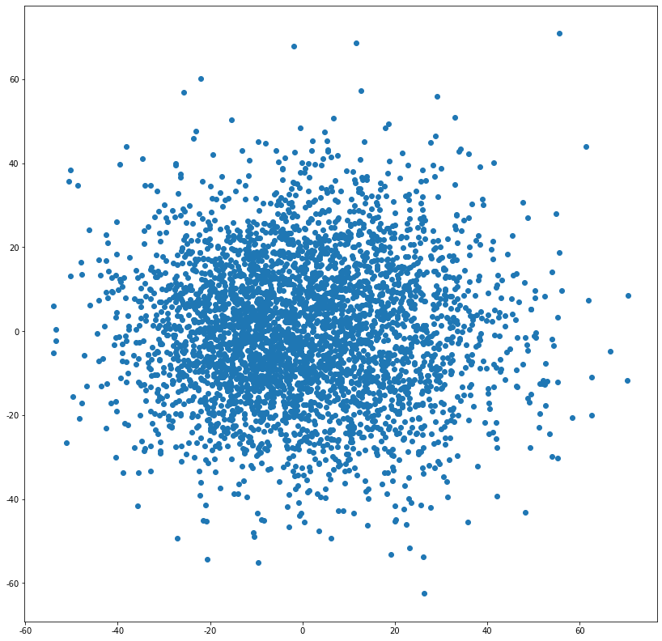
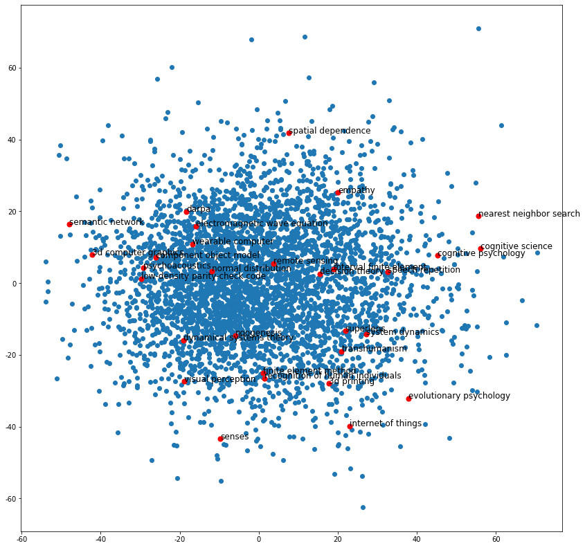
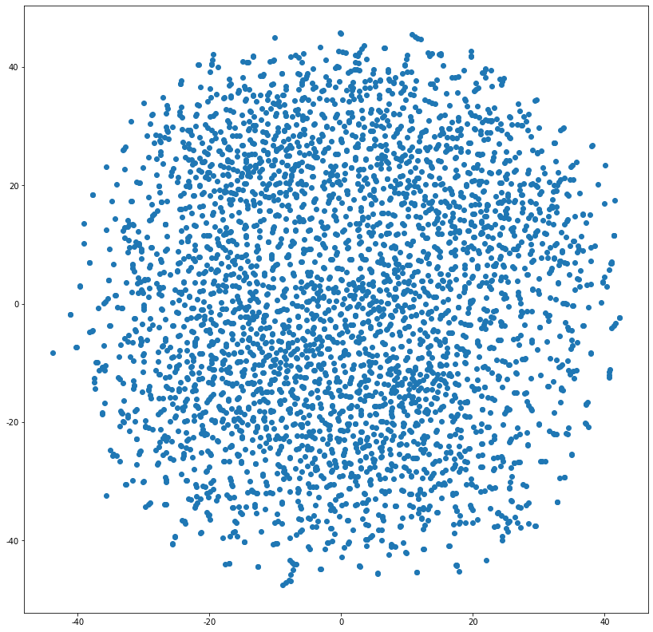
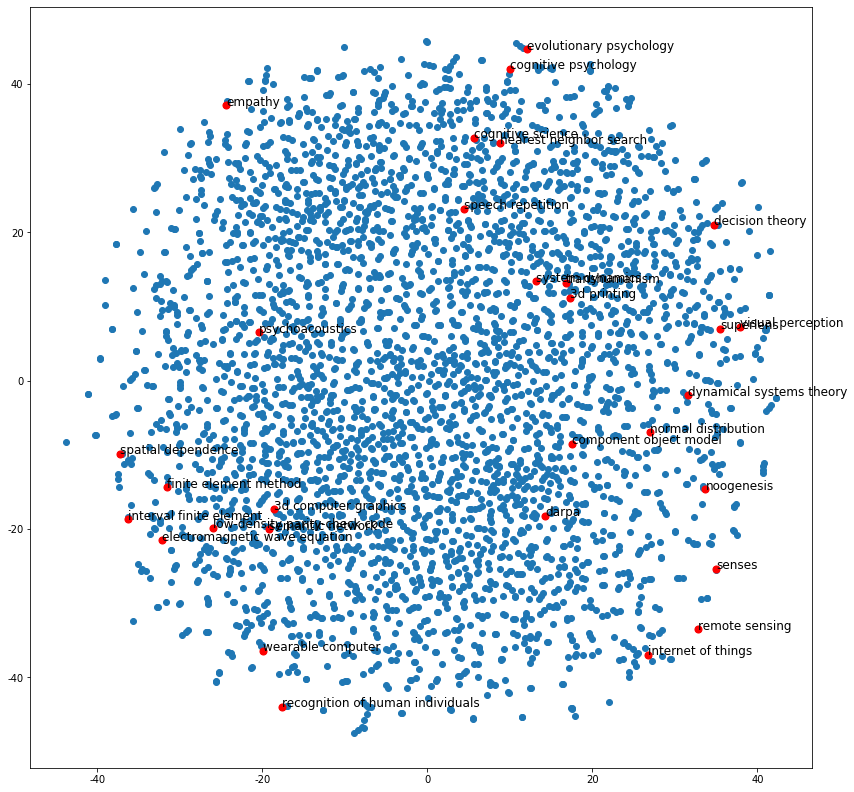

# DeepWalk

## DeepWalk介绍

解决的是图嵌入问题：

* 将Graph的每一个节点编码成为一个D维向量。
* Embedding隐式包含了Graph中的社群、连接、结构特点，原图中相近的节点，嵌入后依然相近。

直接套用Word2Vec：

### Word2Vec

* CBOW：输入周围词预测中心词
* Skip-Gram：输入中心词预测周围词


两种方法，构造语言模型中自监督问题，编码词向量，反映词相似性。

### DeepWalk

通过在图中随机游走，生成随机游走序列。

* 一段随机游走序列类似Word2Vec一句话，序列的节点类似Word2Vec单词。
* Word2Vec假设一句话相邻单词相关，DeepWalk也假设随机游走序列相邻节点是相关的。
* 同样构造Skip-Gram问题，输入中心节点预测周围节点

### 图嵌入

* 为什么要把图变成特征，为什么要做图嵌入，图编码？
  * 机器学习第一步就是要提取特征。
  * 可以手动构造特征；
  * 图可以通过邻接矩阵表示关系，自动学习特征。

*  降维
  * one-hot encoding -> latent dimensions
  * 可以手动，可以用机器学习的方式
  * DeepWalk通过机器学习的方式，自监督学习一个latent representation。构造一个低维、稠密、连续向量，表示每一个节点

### Cool Idea

套用语言模型，Short random walks = sentences

### DeepWalk步骤

1. 输入图
2. 采样随机游走序列
   * 每个节点产生$ \gamma$个随机游走序列，最大长度为*t*
3. 用随机游走序列训练Word2Vec
   * 构造Skip-gram任务，输入中心词编码表示预测周围词
4. 为了解决分类个数过多，加分层softmax（霍夫曼编码树），输入节点的嵌入表示，进行二分类逻辑回归
   * 需要学习两套参数，每个节点的词向量嵌入表；每个逻辑回归的权重
5. 得到节点图嵌入向量表示

### 改进

* Steaming：不需要知道图的全貌。
* Non-Random walk：游走可以有一些倾向性。

### 讨论

- 首个将深度学习和自然语言处理的思想用于图机器学习
- 在稀疏标注节点分类场景下，嵌入性能卓越
- 均匀随机游走，没有偏向的游走方向
- 需要大量随机游走序列训练
- 基于随机游走，管中窥豹，距离较远的两个节点无法相互影响。看不到全图信息。
- 无监督，仅编码图的连接信息，没有利用节点的属性特征。
- 没有真正用到神经网络和深度学习

## DeepWalk论文精读

《DeepWalk：Online Learning of Social Representations》

### 摘要

* DeepWalk是一种新颖的，用于学习隐式语义表征的表示学习方法。
* DeepWalk将节点在图中的连接关系，编码成稠密、连续、低维的向量，可用于后续的统计机器学习分类。
* DeepWalk把现有的自然语言处理对文本和单词的建模方法用到图里，对节点做图嵌入。
* DeepWalk比拥有网络全局视野的竞品效果更好，尤其是在稀疏标注场景下。
* DeepWalk可扩展，即来即学的在线学习，迭代增量学习，并且是可并行的。

### 介绍

* 网络上非常稀疏的，这种稀疏结构有优点也有缺点：
  * 稀疏结构使离散算法成为可能，例如：最短路径算法。
  * 对用统计机器学习去分类、回归，稀疏性是非常麻烦的。
* DeepWalk通过一连串随机游走序列，学习网络的连接结构信息：
  * 包含每个节点的邻域、社群信息
  * 编码成连续、低维、稠密（每个元素不为0）的向量空间
* DeepWalk输入图，输出每个节点的embedding
  * 图节点之间有连接，违法了传统机器学习中i.i.d.假设
  * DeepWalk是无监督学习，与节点label无关
* DeepWalk可扩展性非常好
  * 可扩展到互联网级别的图（例如Youtube）
  * 可并行

### 定义

定义图*G*=(*V*,*E*)，V表示节点，E表示连接；

其中，$E \subseteq(V \times V)$是V行V列的邻接矩阵

带标注的社交网络表示为$G_{L}=(V, E, X, Y)$

$X \in \mathbb{R}^{|V| \times S} $表示每个节点有*S*维特征，$Y \in \mathbb{R}^{|V| \times|\mathcal{Y}|}$表示每个节点有$\ \mathcal{Y}$个标注。

DeepWalk不把标签和连接特征混合，仅在Embedding中编码连接信息。网络结构信息和标签信息的区分，防止误差累积。

进一步，可以将反映连接信息的Embedding *+* 反映节点本身的特征，结合机器学习，解决节点分类问题。

### 表示学习

#### Embedding特性

* Adaptability：灵活可变，弹性扩容；
* Community aware：反映社群聚类信息，原图中相近的节点，嵌入后依然相近。
* Low dimensional：低维度=嵌入有助于防止过拟合。
* Continuous：除了提供社群细微差别，连续性具有平滑的决策边界，能够使分类更具鲁棒性。

#### 随机游走

通过随机过程$W_{v_{i}}^{1}, W_{v_{i}}^{2}, \ldots, W_{v_{i}}^{k}$得到随机游走序列，把邻域，局部的社群信息捕获到。

可以并行，在线增量学习，且只需要对局部建模。

#### 幂律分布

真实世界中那些有趣的网络大多数都不是随机的，在一些非随机网络中分布着大型中心节点。绝大多数节点的度很小，而这些大型节点形成重尾。

无标度网络中节点的度大致遵循有一个“重尾”的幂律分布。这种分布没有特征尺度，所以称为“无标度“。

#### 语言模型

用前n-1个词预测第n个词，
$$
\operatorname{Pr}\left(v_{i} \mid\left(v_{1}, v_{2}, \cdots, v_{i-1}\right)\right)
$$
推广到图，用节点的Embedding（而不是用节点本身），用前i-1个节点预测第i个节点。
$$
\operatorname{Pr}\left(v_{i} \mid\left(\Phi\left(v_{1}\right), \Phi\left(v_{2}\right), \cdots, \Phi\left(v_{i-1}\right)\right)\right)
$$
Φ是一个查表操作，提取节点Embedding的函数。

但是，随着长度增长时，计算条件概率（n个概率连乘）将不可行。

于是构建一个自监督学习场景，即Skip-Gram.

#### DeepWalk（Skip-Gram）损失函数

$$
\begin{array}{c}\min _{\Phi}-\log \operatorname{Pr}\left(\frac{\left\{v_{i-w}, \cdots, v_{i+w}\right\}}{v_{i}} \mid \Phi\left(v_{i}\right)\right) \\ \operatorname{Pr}\left(\frac{\left\{v_{i-w}, \cdots, v_{i+w}\right\}}{v_{i}} \mid \Phi\left(v_{i}\right)\right)=\prod_{j=i-w, j \neq i} \operatorname{Pr}\left(v_{j} \mid \Phi\left(v_{i}\right)\right)\end{array}
$$

输入第i个节点的embedding，预测上文*w*个节点和下文*w*个节点。

是一个最大似然概率问题，即希望输入中心词预测出周围词的概率越大越好。

### 伪代码

#### DeepWalk $ DeepWalk(G,w,d,\lambda,t)$

$Input: graph \ G(V,E)$

​		$ windows \ size \  w$ （左右窗口宽度）

​		$ embedding \ size \ \mathcal{d}$ （Embedding维度）

​		$ walks \ per \ vertex \ \gamma $ （每个节点作为起始节点生成随机游走的次数）

​		$ walk \ length \ \mathcal{t} $ （随机游走最大长度）

$ Output: maxtrix \ of \ vertex \ representations \ \Phi \in R^{V \mid \times d}$ 	

$ 1: Initialization: Sample \ \Phi \ from \ \mathcal{U}^{|V| \times d}$

$ 2: Build \ a \ binary \ Tree \ T \ from \ V$

$ 3: for \ i=0 \ to \ \gamma \ do $

$ 4: \ \ \quad \mathcal{O}=\operatorname{Shuffle}(V) $ （随机打乱节点顺序）

$ 5: \ \ \ \ for \ each \ v_{i} \in \mathcal{O} \ do  $（遍历graph中的每个点)

$ 6: \ \ \ \ \mathcal{W}_{v_{i}}=\operatorname{RandomWalk}\left(G, v_{i}, t\right)$（生成一个随机游走序列）

$7: \ \ \ \ \operatorname{SkipGram}\left(\Phi, \mathcal{W}_{v_{i}}, w\right)$（由中心节点Embedding预测周围节点，更新Embedding）

$8: \ \  end \ for$

$9:end \ for$

#### Skip-Gram $\operatorname{SkipGram}\left(\Phi, \mathcal{W}_{v_{i}}, w\right)$

$ 1:for \ each \ v_{i} \in \mathcal{W}_{v_{i}} \ do  $（遍历当前随机游走序列的每个字节

$ 2: \ \ for \ each \ u_{k} \in \mathcal{W}_{v_{i}}\ [j-w, j+w] \ do$（遍历该节点周围窗口里的每个点）

$3: \ \ \ \ J(\Phi)=-\log \operatorname{Pr}\left(u_{k} \mid \Phi\left(v_{j}\right)\right)$ （计算损失函数）

$ 4: \Phi=\Phi-\alpha * \frac{\partial J}{\partial \Phi}$ （梯度下降更新Embedding矩阵）

$5: \ \  end \ for$

$6:end \ for$

PS：Prob直接算向量的数量积
$$
\operatorname{Pr}\left(b_{l} \mid \Phi\left(v_{j}\right)\right)=1 /\left(1+e^{-\Phi\left(v_{j}\right) \cdot \Psi\left(b_{l}\right)}\right)
$$

### 相关工作

1. Embedding通过机器学习得到的，而非人工统计构造得到的
2. 无监督，不考虑节点的label信息，只靠graph连接信息
3. 在线学习，仅使用graph的局部信息
4. 将无监督学习（深度学习）应用在图上


## 代码实战

### 导入工具包


```python
import networkx as nx #图数据挖掘

import pandas as pd
import numpy as np

import random
from tqdm import tqdm

import matplotlib.pyplot as plt
%matplotlib inline
```

### 导入数据


```python
df = pd.read_csv('seealsology-data.tsv',sep = "\t")
```


```python
df.head()
```

<table border="1" class="dataframe">
  <thead>
    <tr style="text-align: right;">
      <th></th>
      <th>source</th>
      <th>target</th>
      <th>depth</th>
    </tr>
  </thead>
  <tbody>
    <tr>
      <th>0</th>
      <td>support vector machine</td>
      <td>in situ adaptive tabulation</td>
      <td>1</td>
    </tr>
    <tr>
      <th>1</th>
      <td>support vector machine</td>
      <td>kernel machines</td>
      <td>1</td>
    </tr>
    <tr>
      <th>2</th>
      <td>support vector machine</td>
      <td>fisher kernel</td>
      <td>1</td>
    </tr>
    <tr>
      <th>3</th>
      <td>support vector machine</td>
      <td>platt scaling</td>
      <td>1</td>
    </tr>
    <tr>
      <th>4</th>
      <td>support vector machine</td>
      <td>polynomial kernel</td>
      <td>1</td>
    </tr>
  </tbody>
</table>

```python
df.shape
```


    (5546, 3)

### 构建无向图


```python
G = nx.from_pandas_edgelist(df, "source", "target", edge_attr=True, create_using=nx.Graph())
```


```python
len(G)
```


    3822

### 生成随机游走节点序列的函数


```python
def get_randomwalk(node, path_length):
    '''
    输入起始节点和路径长度，生成随机游走节点序列
    '''
    random_walk = [node]
    
    for i in range(path_length-1):
        #汇总邻接节点
        temp = list(G.neighbors(node))
        temp = list(set(temp) - set(random_walk))
        if len(temp) == 0:
            break
        # 从邻接节点选择下一个节点
        random_node = random.choice(temp)
        random_walk.append(random_node)
        node = random_node
    return random_walk
```


```python
all_nodes = list(G.nodes())
```


```python
get_randomwalk('random forest',5)
```


    ['random forest',
     'decision tree',
     'odds algorithm',
     'predictive analytics',
     'criminal reduction utilising statistical history']

### 生成随机游走序列


```python
gamma = 10 # 每个节点作为起始节点生成随机游走序列个数
walk_length = 5 # 随机游走序列最大长度
```


```python
random_walks = []

for n in tqdm(all_nodes):
    for i in range(gamma):
        random_walks.append(get_randomwalk(n,walk_length))
```

    100%|██████████| 3822/3822 [00:00<00:00, 9710.00it/s]

```python
len(random_walks)
```


    38220


```python
random_walks[1]
```


    ['support vector machine',
     'in situ adaptive tabulation',
     'tensor product network',
     'artificial neural network',
     'opennn']


### 训练Word2Vec模型


```python
from gensim.models import Word2Vec
```


```python
model = Word2Vec(vector_size=256, # Embedding维数
                 window=4, # 窗口宽度
                 sg=1, # Skip-Gram
                 hs=9, # 不加分层softmax
                 negative=10, # 负采样
                 alpha=0.3, # 初始学习率
                 min_alpha=0.0007, # 最小学习率
                 seed=14 # 随机数种子
                )
```


```python
# 用随机游走序列构建词汇表
model.build_vocab(random_walks, progress_per=2)
```


```python
# 训练（耗时1分钟左右）
model.train(random_walks, total_examples=model.corpus_count, epochs=50, report_delay=1)
```


    (7182102, 7192350)

### 分析Word2Vec结果


```python
# 查看某个节点的Embedding
model.wv.get_vector('random forest').shape
```


    (256,)


```python
# 找相似词语
model.wv.similar_by_word('decision tree')
```


    [('ambigram', 0.7562729716300964),
     ('maneuver warfare', 0.7239264249801636),
     ('lorentzian function', 0.7060577869415283),
     ('decision management', 0.697400689125061),
     ('geodemographic segmentation', 0.696292519569397),
     ('office of naval research', 0.6937933564186096),
     ('intentionality', 0.6876163482666016),
     ('kernel perceptron', 0.6858272552490234),
     ('legal realism', 0.682734489440918),
     ('foundations and trends in electronic design automation',
      0.6672760844230652)]

### PCA降维可视化

#### 可视化全部词条的二维Embedding


```python
X = model.wv.vectors
```


```python
# 将Embedding用PCA降维到2维
from sklearn.decomposition import PCA
pca = PCA(n_components=2)
embed_2d = pca.fit_transform(X)
```


```python
plt.figure(figsize=(14,14))
plt.scatter(embed_2d[:,0], embed_2d[:,1])
plt.show()
```



    


### 可视化某个词条的二维Embedding


```python
term = 'computer vision'
```


```python
term_256d = model.wv[term].reshape(1,-1)
```


```python
term_2d = pca.transform(term_256d)
```


```python
plt.figure(figsize=(14,14))
plt.scatter(embed_2d[:,0], embed_2d[:,1])
plt.scatter(term_2d[:,0],term_2d[:,1],c='r',s=200)
plt.show()
```


    


### 可视化某些词条的二维Embedding


```python
# 计算PageRank重要度
pagerank = nx.pagerank(G)
# 从高到低排序
node_importance = sorted(pagerank.items(), key=lambda x:x[1],reverse=True)
```


```python
# 取最高的前n个节点
n = 30
terms_chosen = []
for each in node_importance[:n]:
    terms_chosen.append(each[0])
```


```python
# 输入词条，输出词典中的索引号
term2index = model.wv.key_to_index
```


```python
# 可视化全部词条和关键词条的二维Embedding
plt.figure(figsize=(14,14))
plt.scatter(embed_2d[:,0], embed_2d[:,1])

for item in terms_chosen:
    idx = term2index[item]
    plt.scatter(embed_2d[idx,0], embed_2d[idx,1],c='r',s=50)
    plt.annotate(item, xy=(embed_2d[idx,0], embed_2d[idx,1]),c='k',fontsize=12)
plt.show()
```



    


### TSNE降维可视化

#### 可视化全部词条的二维Embedding


```python
# 将Embedding用TSNE降维到2维
from sklearn.manifold import TSNE
tsne = TSNE(n_components=2, n_iter=1000)
embed_2d = tsne.fit_transform(X)
```

```python
plt.figure(figsize=(14,14))
plt.scatter(embed_2d[:,0], embed_2d[:,1])
plt.show()
```



    


#### 可视化全部词条和关键词条的二维Embedding


```python
plt.figure(figsize=(14,14))
plt.scatter(embed_2d[:,0], embed_2d[:,1])

for item in terms_chosen:
    idx = term2index[item]
    plt.scatter(embed_2d[idx,0], embed_2d[idx,1],c='r',s=50)
    plt.annotate(item, xy=(embed_2d[idx,0], embed_2d[idx,1]),c='k',fontsize=12)
plt.show()
```



    

