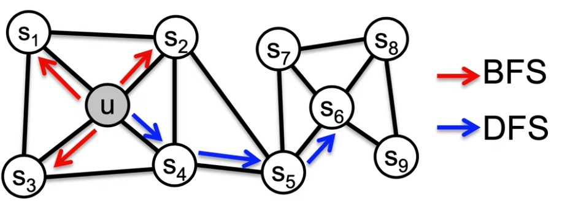
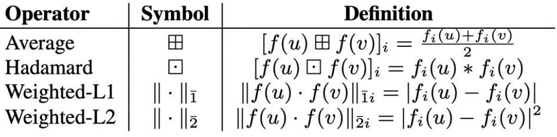
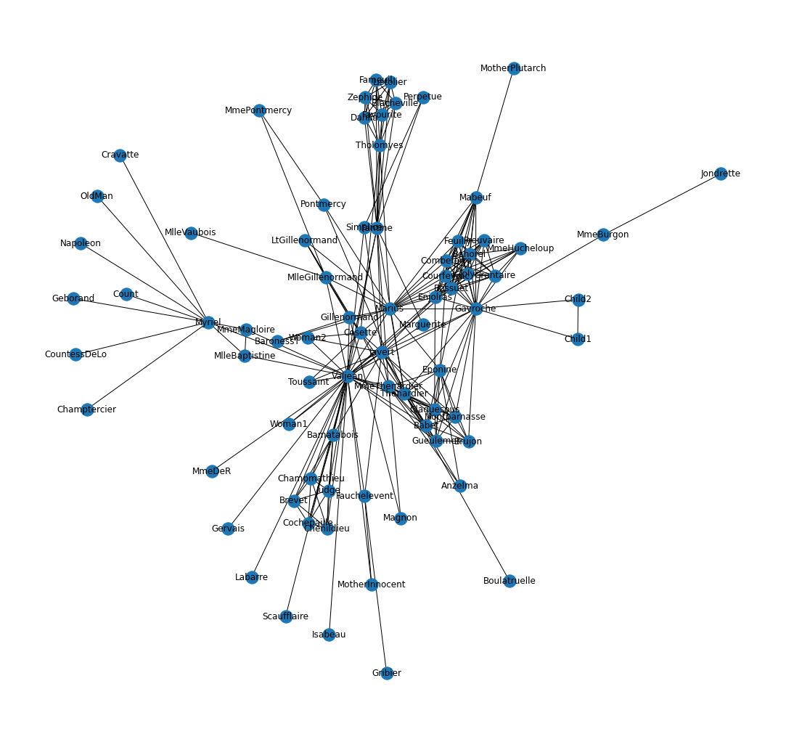
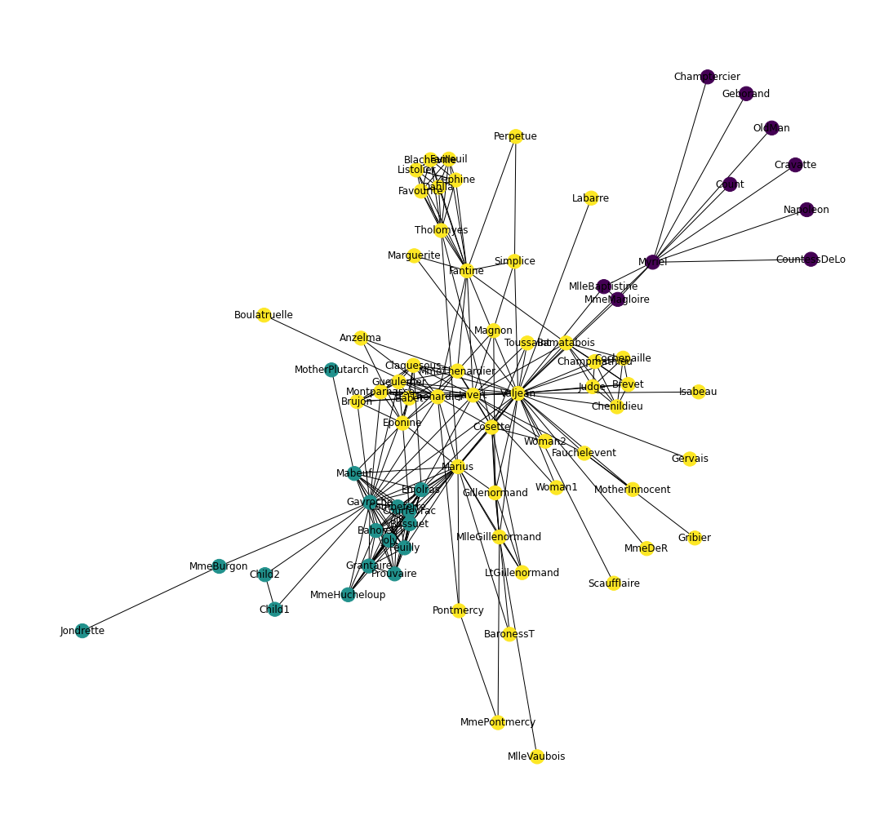
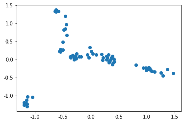
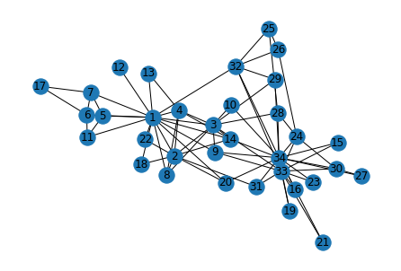

# Node2Vec

## Node2Vec简介

### 图嵌入

把节点编码（嵌入）成一个低维，稠密（元素都不为0），连续（元素都是实数）的向量。向量包含原来节点的信息，特别是语义信息。

应用在节点分类、连接预测、图分类、异常检测、聚类等机器学习擅长的场景，前提是向量质量足够好。

在有限D维度内，向量要充分表达节点在图中的信息，特别是语义信息、结构信息、关联信息、社群信息、邻域信息。

图嵌入分类：

节点、边、子图、全图

图嵌入方法：

基于手工构造特征、基于矩阵分解、基于随机游走、基于图神经网络

### DeepWalk

把Word2Vec（Skip-Gram）用在了图里。随机游走序列当作句子，节点当作单词来训练节点的嵌入。

优点：

通过完全随机游走序列编码每个节点的社群、邻域信息。

缺点：

仅能表达相邻节点的社群相似信息，无法表达离得很远但很相似（在节点结构、角色、功能上的相似性）

### Node2Vec

通过有偏随机游走，解决DeepWalk的缺点。

​	$ \alpha = \frac{1}{p}$时，返回上一个节点t（与节点t距离为0）

​	$ \alpha = 1$时，徘徊（与节点t距离为1）

​	$ \alpha = \frac{1}{q}$时，远行（与节点t距离为2）

当$ p $很小时，属于广度优先搜索（BFS），反映微观的邻域，捕捉节点功能角色（structural equivalence）（中枢、桥接、边缘）

当$ q $很小时，属于深度优先搜索（DFS），反映宏观的邻域，捕捉同质社群（homophily）（社交网络）

Node2Vec里是二阶随机游走（二阶马尔科夫），下一个节点取决于当前节点和上一个节点

#### 步骤

1. 生成随机游走采样策略
2. 每个节点生成$r$个随机游走序列
   1. 当前节点根据采样策略$(p,q)$找到下一个节点
3. 通过Skip-Gram训练得到节点嵌入表示

### 总结

- 解决图嵌入问题，将图中的每个节点映射为一个向量（嵌入）
- 向量（嵌入）包含了节点的语义信息（相邻社群和功能角色）
- 语义相似的节点，向量（嵌入）的距离也近
- 向量（嵌入）用于后续的分类、聚类、Link Prediction、推荐等任务
- 在DeepWalk完全随机游走的基础上，Node2Vec增加参数p和q，实现有偏随机游走。不同的p、q组合，对应了不同的探索范围和节点语义
- DFS深度优先探索，相邻的节点，向量（嵌入）距离相近
- BFS广度优先探索，相同功能角色的节点，向量（嵌入）距离相近
- DeepWalk是Node2Vec在$p=1$，$q=1$的特例

### 讨论

* 通过调节$p$、$q$值，实现有偏随机游走，探索节点社群、功能等不同属性
* 首次把节点分类用于Link Prediction
* 可解释性、可拓展性好，性能卓越
* 需要大量随机游走序列训练。
* 距离较远的两个节点无法直接相互影响。看不到全图信息。
* 无监督，仅编码图的连接信息，没有利用节点的属性特征。
* 没有真正用到神经网络和深度学习。

## Node2Vec论文精读

### 摘要

对于网络中的节点和边的预测任务，首先需要做特征工程把它们变成向量。

表示学习（例如DeepWalk）已经有了些非常好的尝试，但表示能力还不够高。无法反映节点更丰富的特征和更多样性的连接属性。

Node2Vec通过把节点映射成连续、低维、稠密的向量，输入图，使用极大似然估计实现向量的训练，输出向量。

Node2Vec定义了非常灵活的有偏随机游走范式，可以灵活探索网络的不同多样化的属性，特征。

### 介绍

节点和边、图的数据挖掘，很多任务都是对节点和边来做预测，可以抽象为节点分类任务和连接预测任务。

任何监督学习的机器学习问题都需要内含丰富语义，有分类区分性，并且相互独立的特征。

对于网络和图，需要把节点Embedding变成一个向量，向量也应该具有丰富的语义信息来反映节点的特征。

1. 通过专家知识，人工构造特征。
2. 通过有监督的机器学习，针对特定任务（目标函数）优化
3. 无监督，构造通用特征（与下游任务无关）

4. 现在的技术，对于无监督学习是不满足的。所以提出了基于矩阵分解的图嵌入。
   1. 无法扩展到更大的图，求特征值会变得很麻烦。
5. 基于随机游走的图嵌入。
   1. Word2Vec，用SGD去优化图嵌入表，用Skip-Gram范式（中心节点预测周围节点）去训练图向量。
   2. 只能采样邻域信息，没有全图信息。

真实的网络是社群同质属性（homophily）和（structural equivalence）两种特质的混合，所以在图嵌入时，算法设计应该足够灵活，兼顾这两种特质：同一社群里的节点，应该编码为相近的Embedding；同一种功能角色的节点，也应该编码为相近的Embedding。

Node2Vec，半监督自监督的学习来进行节点嵌入：

* 优化一个自定义的目标函数，使用SGD，用到Word2Vec的Skip-Gram。

* 直观来讲，就是使用极大似然估计，通过中间节点预测周围节点，使得事件发生的概率最大化。

* 采样的随机游走序列使用二阶有偏随机游走去采样。
  * 一阶随机游走（一阶马尔科夫性），下一节点仅与当前节点有关：DeepWalk，PageRank
  * 二阶随机游走（二阶马尔科夫性），下一节点不仅与当前节点有关，还与上一节点有关。

Node2Vec关键贡献

* 设计了灵活的采样策略，通过有偏随机游走，既可以提取homophily，又可以提取structural equivalence。
* 可以通过调节参数来灵活控制，并且调$p$、$q$有直观的几何解释。最优的$p$、$q$可通过调参得到。
* 不管对节点可以做嵌入，也可以对连接做嵌入。通过二元操作把任意两个节点的embedding组合在一起，作为连接的embedding，去做link prediction。

相关工作

- 传统方法的缺点：基于手工设计特征的图嵌入，但是该方式非常笨拙，不通用；
- 通过机器学习的表示学习，自动获得每个节点的嵌入特征；
  - 基于矩阵分解的图嵌入，例如Laplacian矩阵、PCA方法。
    - 涉及特征值计算很难，并且也不通用。
  - 基于随机游走的图嵌入
    - 套用Word2用中间词预测周围词的方法（Skip-Gram）：
    - DeepWalk和LINE缺少采样策略。
    - Node2Vec通过调参改变搜索空间。
  - 基于监督学习的图嵌入：用节点的标签进行图嵌入，直接优化下游任务的损失函数，使图嵌入适应下游的分类任务。
    - 但很多节点分类场景，标签非常稀疏；用标签训练出的图嵌入，只能用来解决和标签相关的图嵌入。

### 定义

定义图$G=(V, E)$，$V$是节点个数，$E$是连接数。

目标是学习一个映射$f: V \rightarrow \mathbb{R}^{d}$，把每一个节点映射成为d维实数向量（低维、连续、稠密）

输出一个表格$|V| \times d$的$f$，每一个节点对应$d$维的嵌入。

每一个节点$u \in V$的领域节点，用$N_{S}(u) \subset V$表示；采用策略是$S$。

Skip-Gram损失函数：
$$
\max _{f} \sum_{u \in V} \log \operatorname{Pr}\left(N_{S}(u) \mid f(u)\right)
$$
输入节点$u$的Embedding，输出邻居节点$u$；用中间节点预测周围节点，让$Pr(*)$最大化，遍历图中每个节点。

两个简化假设：

1. 条件独立（马尔科夫假设）：周围节点互不影响
   $$
   \operatorname{Pr}\left(N_{S}(u) \mid f(u)\right)=\prod_{n_{i} \in N_{S}(u)} \operatorname{Pr}\left(n_{i} \mid f(u)\right) .
   $$

2. 对称性：两个节点之间相互影响的程度一样

   可以用Softmax来计算$\operatorname{Pr}\left(n_{i} \mid f(u)\right)$

$$
\operatorname{Pr}\left(n_{i} \mid f(u)\right)=\frac{\exp \left(f\left(n_{i}\right) \cdot f(u)\right)}{\sum_{v \in V} \exp (f(v) \cdot f(u))}
$$

Skip-Gram损失函数（简化）：
$$
\max _{f} \sum_{u \in V}\left[-\log Z_{u}+\sum_{n_{i} \in N_{S}(u)} f\left(n_{i}\right) \cdot f(u)\right]
$$
其中，
$$
Z_{u}=\sum_{v \in V} \exp (f(u) \cdot f(v))
$$

### 搜索策略



- DFS：同质社群（homophily）（社交网络）
  - 宏观视角，方差大，难以表达局部特征
- BFS：节点功能角色（structural equivalence）（中枢、桥接、边缘）
  - 微观视角，方差小

这两种搜索策略是两种极端策略，真实的图是两种特质（homophily和structural equivalence）的混合。

### Node2Vec

#### 随机游走

* 定义

  $u$ 起始节点

  $t$ 上一节点，$N_{s}(t)$上一节点的邻居节点

  $v$当前节点，$k$当前节点$v$的邻居节点个数

  $x$下一节点，$l$随机游走序列节点个数
  $$
  P\left(c_{i}=x \mid c_{i-1}=v\right)=\left\{\begin{array}{ll}\frac{\pi_{v x}}{Z} & \text { if }(v, x) \in E \\ 0 & \text { otherwise }\end{array}\right\}
  $$
  $\pi_{v x}$为连接的权重，$Z$是归一化常数。

* 采样策略

  最简单的采样策略，如果是带权重的图，直接用连接权重作为随机游走概率，但无法调节搜索策略。

  直接用BFS、DFS太极端，无法折衷平滑调节。

  提出了二阶随机游走策略，令$\pi_{v x}=\alpha_{p q}(t, x) \cdot w_{v x}$
  $$
  \alpha_{p q}(t, x)=\left\{\begin{array}{ll}\frac{1}{p} & \text { if } d_{t x}=0 \\ 1 & \text { if } d_{t x}=1 \\ \frac{1}{q} & \text { if } d_{t x}=2\end{array}\right.
  $$
  其中，$d_{t x}$为从$t$到$x$的最短路径长度。

#### 复杂度

* 空间复杂度：
  * 存一个邻接表：$O(|E|)$
  * 二阶随机游走：$O\left(a^{2}|V|\right)$，$a$是图中每个节点的平均连接数（二阶随机游走，所以是$a^{2}$）
* 时间复杂度：$O\left(\frac{l}{k(l-k)}\right)$

#### 伪代码

##### LearnFeature $(Graph G=(V, E, W), Dimensions \ d, Walks \ per \ node \ r, Walk \ length \ l, Context \ size \ k, Return \ p, In$-$out \ q )$

​	$\pi= PreprocessModifiedWeights (\mathrm{G}, \mathrm{p}, \mathrm{q})$（生成随机游走采样策略）

​	$G^{\prime}=(\bar{V}, E, \pi)$

​	$Initialize \ walks \ to \ Empty$

​	$for \ iter \ = \ 1 \ to \ r \ do$ （每个节点生成$r$个随机游走序列）

​		$for \ all \ nodes \ u \in V \ do$

​			$walk = node2vecWalk\left(G^{\prime}, u, l\right)$ （生成1个随机游走序列）

​			$Append \ walk \ to \ walks$

​	$f= StochasticGradientDescent (k, d, walks)$ （Skip-Gram训练得到节点嵌入表示）

​	$return \ f$

##### node2vecWalk $(Graph \ G^{\prime}=(V, E, \pi), Start \ node \ u, Length \left.l\right)$

​	$Inititalize \ walk \ to \ [u]$ （生成1个随机游走序列）

​	$ for \ w a l k \_i t e r=1 \ to \ l \ do $ 

​		$ curr \ = \ walk[-1] $

​		$V_{c u r r}=\operatorname{GetNeighbors}\left(c u r r, G^{\prime}\right)$

​		$s= \ AliasSample \left(V_{c u r r}, \pi\right)$

​		$Append \ s \ to \ walk$

​	$return \ walk $

Alias Sample：用于产生下一个随机游走节点，时间复杂度为$O(1)$，用空间（预处理$O(n)$）换时间，适用于大量反复的抽样情况下，将离散分布抽样转化为均匀分布抽样。

#### Node Embedding扩展到Link Embedding

通过自助法（bootstrapping），用二元操作符来操作，将节点的嵌入变成连接的嵌入。



## Node2Vec代码实战

### 导入工具包


```python
import networkx as nx #图数据挖掘
import numpy as np
import random

import matplotlib.pyplot as plt
%matplotlib inline
plt.rcParams['font.sans-serif']=['SimHei']  # 用来正常显示中文标签  
plt.rcParams['axes.unicode_minus']=False  # 用来正常显示负号
```

#### 导入数据集


```python
# 《悲惨世界》人物数据集
G = nx.les_miserables_graph()
```


```python
# 可视化
plt.figure(figsize=(15,14))
pos = nx.spring_layout(G,seed=5)
nx.draw(G,pos,with_labels=True)
plt.show()
```

​    


### 构建Node2Vec模型


```python
from node2vec import Node2Vec
```


```python
# 设置node2vec参数
node2vec = Node2Vec(
    G, 
    dimensions=32,  # 嵌入维度
    p=2,            # 回家参数
    q=0.5,            # 外出参数
    walk_length=30, # 随机游走最大长度
    num_walks=600,  # 每个节点作为起始节点生成的随机游走个数
    workers=4       # 并行线程数
)

# p=1, q=0.5, n_clusters=6。DFS深度优先搜索，挖掘同质社群
# p=1, q=2, n_clusters=3。BFS宽度优先搜索，挖掘节点的结构功能。

# 训练Node2Vec
model = node2vec.fit(
    window=3,     # Skip-Gram窗口大小
    min_count=1,  # 忽略出现次数低于此阈值的节点（词）
    batch_words=4 # 每个线程处理的数据量
)
X = model.wv.vectors
```


    Computing transition probabilities:   0%|          | 0/77 [00:00<?, ?it/s]


    Generating walks (CPU: 4): 100%|██████████| 150/150 [00:18<00:00,  8.05it/s]

### 节点Embedding聚类可视化

#### 运行聚类


```python
# KMeans聚类
from sklearn.cluster import KMeans
import numpy as np
cluster_labels = KMeans(n_clusters=3).fit(X).labels_
print(cluster_labels)
```

    [2 2 1 1 2 2 1 1 1 0 2 2 1 2 1 1 2 2 2 2 0 2 2 2 2 2 2 0 2 2 2 2 1 1 2 2 2
     1 2 2 2 2 2 2 1 2 1 1 2 2 1 2 2 2 2 2 0 2 1 2 2 2 2 0 0 0 0 1 0 0 2 2 2 2
     2 2 2]


#### 将networkx中的节点和词向量中的节点对应


```python
colors = []
nodes = list(G.nodes)
for node in nodes: # 按 networkx 的顺序遍历每个节点
    idx = model.wv.key_to_index[str(node)] # 获取这个节点在 embedding 中的索引号
    colors.append(cluster_labels[idx]) # 获取这个节点的聚类结果
```

#### 可视化聚类效果


```python
plt.figure(figsize=(15,14))
pos = nx.spring_layout(G, seed=10)
nx.draw(G, pos, node_color=colors, with_labels=True)
plt.show()
```

​    

### 节点Embedding降维可视化


```python
# 将Embedding用PCA降维到2维
from sklearn.decomposition import PCA
pca = PCA(n_components=2)
embed_2d = pca.fit_transform(X)
```


```python
plt.scatter(embed_2d[:, 0], embed_2d[:, 1])
plt.show()
```





```python
# 查找 Napoleon 节点的相似节点
model.wv.most_similar('Napoleon')
```


    [('OldMan', 0.989684522151947),
     ('CountessDeLo', 0.9839681386947632),
     ('Cravatte', 0.9785941243171692),
     ('Champtercier', 0.9759071469306946),
     ('Count', 0.971480667591095),
     ('Geborand', 0.9604766368865967),
     ('MlleBaptistine', 0.9476986527442932),
     ('MmeMagloire', 0.9329050779342651),
     ('Myriel', 0.8821046352386475),
     ('MmeDeR', 0.4888058602809906)]


```python
# 查看任意两个节点的相似度
model.wv.similarity('Napoleon','Brujon')
```


    0.1833646

### 对Edge（连接）做Embedding


```python
from node2vec.edges import HadamardEmbedder

# Hadamard 二元操作符：两个 Embedding 对应元素相乘
edges_embs = HadamardEmbedder(keyed_vectors=model.wv)

# 查看 任意两个节点连接 的 Embedding
edges_embs[('Napoleon', 'Champtercier')]
```


    array([ 1.9396783e-01,  5.7609178e-02,  4.3227341e-02,  5.0421138e-03,
           -4.6065048e-04, -3.6016354e-04, -1.9395088e-04,  8.0181949e-04,
            2.7538058e-03,  4.6757761e-02,  6.3547147e-03,  9.9086106e-01,
            4.2414546e-01,  1.1863090e-01,  1.9435036e-01,  1.4711268e-01,
            6.1423811e-03,  1.3156745e-01,  8.5025050e-02,  3.0823825e-02,
            1.9402759e-01,  1.0342458e-01,  6.8360579e-01, -4.7818277e-04,
            5.4895919e-02,  2.6068278e-02,  5.2431216e-03,  2.1005590e-01,
            1.0215502e-01,  5.9746110e-01,  1.6285491e-03,  3.2059899e-01],
          dtype=float32)


```python
# 计算所有 Edge 的 Embedding
edges_kv = edges_embs.as_keyed_vectors()
```

    Generating edge features: 100%|██████████| 3003/3003.0 [00:00<00:00, 93128.88it/s]

```python
# 查看与某两个节点最相似的节点对
edges_kv.most_similar(str(('Bossuet', 'Valjean')))
```


    [("('Bahorel', 'Valjean')", 0.9044063687324524),
     ("('Combeferre', 'Valjean')", 0.8994634747505188),
     ("('Joly', 'Valjean')", 0.8974180221557617),
     ("('Prouvaire', 'Valjean')", 0.8907101154327393),
     ("('Enjolras', 'Valjean')", 0.8700686693191528),
     ("('Grantaire', 'Valjean')", 0.8325143456459045),
     ("('MmeHucheloup', 'Valjean')", 0.8110198378562927),
     ("('Courfeyrac', 'Valjean')", 0.8097795248031616),
     ("('Feuilly', 'Valjean')", 0.8035134077072144),
     ("('Mabeuf', 'Valjean')", 0.7195153832435608)]

## Node2Vec官方作者Aditya Grover代码解读

### 导入工具包


```python
import warnings
warnings.filterwarnings('ignore')
import argparse
import numpy as np
import networkx as nx
from gensim.models import Word2Vec
import random

import matplotlib.pyplot as plt
%matplotlib inline
```

### 读入命令行参数


```python
def parse_args():
    '''
    Parse the node2vec arguments
    '''
    # 使用parser加载信息
    parser = argparse.ArgumentParser(description="Run node2vec.")
    # 输入文件：邻接表
    parser.add_argument('--input',nargs='?',default='karate.edgelist',
                        help='Input graph path')
    # 输出文件：节点嵌入表
    parser.add_argument('--output',nargs='?',default='karate.emb',
                        help='Embedding path')
    # embedding嵌入向量维度
    parser.add_argument('--dimensions',type=int,default=128,
                        help='Number of dimensions. Default is 128.')
    # 随机游走序列长度
    parser.add_argument('--walk-length',type=int,default=80,
                        help='Length of walk per source. Default is 80.')
    # 每个节点生成随机游走序列次数
    parser.add_argument('--num-walks',type=int,default=10,
                        help='Number of walk per source. Default is 10.')
    # word2vec窗口大小，word2vec参数
    parser.add_argument('--window-size',type=int,default=10,
                        help='Context size for optimization. Default is 10.')
    # SDG优化时epoch数量，word2vec参数
    parser.add_argument('--iter', default=1, type=int,
                        help='Number of epochs in SGD')
    # 并行化核数，word2vec参数
    parser.add_argument('--workers', type=int, default=8,
                        help='Number of parallel workers. Default is 8')
    # 参数p
    parser.add_argument('--p', type=float, default=1,
                        help='Return hyperparameter. Default is 1')
    # 参数q
    parser.add_argument('--q', type=float, default=2,
                        help='Return hyperparameter. Default is 2')
    # 连接是否带权重
    parser.add_argument('--weighted', dest='weighted', action='store_true',
                        help='Boolean specifying (un)weighted. Default is unweighted')
    parser.add_argument('--unweighted', dest='unweighted', action='store_false')
    parser.set_defaults(weighted=False)
    # 有向图还是无向图
    parser.add_argument('--directed', dest='directed', action='store_true',
                        help='Graph is (un)directed. Default is undirected')
    parser.add_argument('--undirected', dest='undirected', action='store_false')
    parser.set_defaults(weighted=False)
    
    return parser.parse_args(args=[])

args = parse_args()
```


```python
args
```


    Namespace(dimensions=128, directed=False, input='karate.edgelist', iter=1, num_walks=10, output='karate.emb', p=1, q=2, undirected=True, unweighted=True, walk_length=80, weighted=False, window_size=10, workers=8)

### 载入图


```python
# 连接带权重
if args.weighted:
    G = nx.read_edgelist(args.input, nodetype=int, data=(('weight', float),), create_using=nx.DiGraph())
# 连接不带权重
else:
    G = nx.read_edgelist(args.input, nodetype=int, create_using=nx.DiGraph())
    for edge in G.edges():
        G[edge[0]][edge[1]]['weight'] = np.abs(np.random.randn())
        
# 无向图
if not args.directed:
    G = G.to_undirected()
```


```python
# 可视化
pos = nx.spring_layout(G,seed=4)
nx.draw(G, pos, with_labels=True)
plt.show()
```



    


### Alias Sampling

#### 参考博客

https://keithschwarz.com/darts-dice-coins \
https://www.bilibili.com/video/av798804262 \
https://www.cnblogs.com/Lee-yl/p/12749070.html 

Algorithm：Naive Alias Method

* Initialization:
  1. Multiply each probability \(p_{i}\) by \(n\).
  2. Create arrays Alias and Prob, each of size \(n\).
  3. For \(j=1\) to \(n-1\) :
     1. Find a probability \(p_{l}\) satisfying \(p_{l} \leq 1\).
     2. Find a probability \(p_{g}\) (with \(l \neq g\) ) satisfying \(p_{g} \geq 1\)
     3. Set \(\operatorname{Prob}[l]=p_{l}\).
     4. Set \(A l i a s[l]=g\).
     5. Remove \(p_{l}\) from the list of initial probabilities.
     6. Set \(p_{g}:=p_{g}-\left(1-p_{l}\right)\).
  4. Let \(i\) be the last probability remaining, which must have weight 1 .
  5. Set \(P r o b[i]=1\).
* Generation
  1. Generate a fair die roll from an \(n\)-sided die; call the side \(i\).
  2. Flip a biased coin that comes up heads with probability Prob \(i]\).
  3. If the coin comes up "heads," return \(i\).
  4. Otherwise, return Alias \([i]\).

### 


```python
def alias_setup(probs):
    K = len(probs)
    # q correspond to Prob
    q = np.zeros(K)
    # J Alias
    J = np.zeros(K, dtype=np.int)
    
    smaller = []
    larger = []
    
    # 将各个概率分成两组，一组的概率值大于1，另一组的概率值小于1
    for kk,prob in enumerate(probs):
        q[kk] = K*prob # 每类事件的概率 乘 事件个数
        
        # 判定“劫富”和“济贫”的对象
        if q[kk] < 1.0:
            smaller.append(kk)
        else:
            larger.append(kk)
    # 使用贪心算法，将概率值小于1的不断填满
    # pseudo code step 3
    while len(smaller) > 0 and len(larger) > 0:
        small = smaller.pop()
        large = larger.pop()
        
        J[small] = large
        # 更新概率值，劫富济贫，削峰填谷
        q[large] = q[large] - (1 - q[small])
        if q[large] < 1.0:
            smaller.append(large) # 把被打倒的土豪归为贫农
        else:
            larger.append(large)
    return J,q
```


```python
def alias_draw(J,q):
    '''
    Draw sample from a non-uniform discrete distribution using alias sampling.
    O(1)的采样
    '''
    K = len(J)
    
    kk = int(np.floor(np.random.rand()*K)) # 生成1到K的随机整数
    if np.random.rand() < q[kk]:
        return kk # 取自己本来就对应的事件
    else:
        return J[kk] # 取alias事件
```


```python
def get_alias_edge(src, dst):
    p = args.p
    q = args.q
    
    unnormalized_probs = []
    
    # 论文3.2.2节核心算法，计算各条边的转移权重
    for dst_nbr in sorted(G.neighbors(dst)):
        if dst_nbr == src:
            unnormalized_probs.append(G[dst][dst_nbr]['weight']/p)
        elif G.has_edge(dst_nbr, src):
            unnormalized_probs.append(G[dst][dst_nbr]['weight'])
        else:
            unnormalized_probs.append(G[dst][dst_nbr]['weight']/q)
    # 归一化各条边的转移权重
    norm_const = sum(unnormalized_probs)
    normalized_probs = [float(u_prob)/norm_const for u_prob in unnormalized_probs]
    
    # 执行 Alias Sampling
    return alias_setup(normalized_probs)
```


```python
get_alias_edge(15,16)
```


    (array([0, 0]), array([1.        , 0.78849162]))


```python
is_directed = args.directed
alias_nodes = {}

# 节点概率alias sampling和归一化
for node in G.nodes():
    unnormalized_probs = [G[node][nbr]['weight'] for nbr in sorted(G.neighbors(node))]
    norm_const = sum(unnormalized_probs)
    normalized_probs = [float(u_prob)/norm_const for u_prob in unnormalized_probs]
    alias_nodes[node] = alias_setup(normalized_probs)
    # 信息展示
    if node == 25:
        print('25号节点')
        print(unnormalized_probs)
        print(norm_const)
        print(normalized_probs)
        print(alias_nodes[node])
```

    25号节点
    [1.699663178271971, 0.2342532442821132, 0.8251695570405603]
    2.7590859795946447
    [0.6160239988322799, 0.08490248075434347, 0.29907352041337665]
    (array([0, 0, 0]), array([1.        , 0.25470744, 0.89722056]))

```python
alias_edges = {}
triads = {}

# 边概率alias sampling和归一化
if is_directed:
    for edge in G.edges():
        alias_edges[edge] = get_alias_edge(edge[0], edge[1])
else:
    for edge in G.edges():
        alias_edges[edge] = get_alias_edge(edge[0], edge[1])
        alias_edges[(edge[1], edge[0])] = get_alias_edge(edge[1], edge[0])
```

### 生成一条随机游走序列


```python
def node2vec_walk(walk_length, start_node):
    # 上一步计算出的alias table，完成O(1)的采样
    
    walk = [start_node]
    
    # 直到生成长度为walk_length的节点序列位为止
    while len(walk) < walk_length:
        cur = walk[-1]
        # 对邻居节点排序，目的是和alias table计算时的顺序对应起来
        cur_nbrs = sorted(G.neighbors(cur))
        if len(cur_nbrs) > 0:
            # 节点序列只有一个节点的情况
            if len(walk) == 1:
                walk.append(cur_nbrs[alias_draw(alias_nodes[cur][0], alias_nodes[cur][1])])
            # 节点序列大于一个节点的情况
            else:
                # 看前一个节点，prev是论文中的节点t
                prev = walk[-2]
                next = cur_nbrs[alias_draw(alias_edges[(prev,cur)][0], 
                                           alias_edges[(prev,cur)][1])]
                walk.append(next)
        else:
            break
            
    return walk
```


```python
node2vec_walk(7,3)
```


    [3, 28, 34, 28, 34, 14, 34]

### 采样得到所有随机游走序列


```python
def simulate_walks(num_walks, walk_length):
    '''
    图中每个节点作为起始节点，生成 num_walk 个随机游走序列
    '''
    walks = []
    nodes = list(G.nodes())
    print('Walk iteration:')
    for walk_iter in range(num_walks):
        print(str(walk_iter+1), '/', str(num_walks))
        # 打乱节点顺序
        random.shuffle(nodes)
        for node in nodes:
            walks.append(node2vec_walk(walk_length=walk_length,start_node=node))
    return walks
```


```python
# 生成训练用的随机游走序列
walks = simulate_walks(args.num_walks, args.walk_length)
```

    Walk iteration:
    1 / 10
    2 / 10
    3 / 10
    4 / 10
    5 / 10
    6 / 10
    7 / 10
    8 / 10
    9 / 10
    10 / 10

```python
# 将node的类型int转化为string
walk_str = []
for walk in walks:
    tmp = [ ]
    for node in walk:
        tmp.append(str(node))
    walk_str.append(tmp)
```

