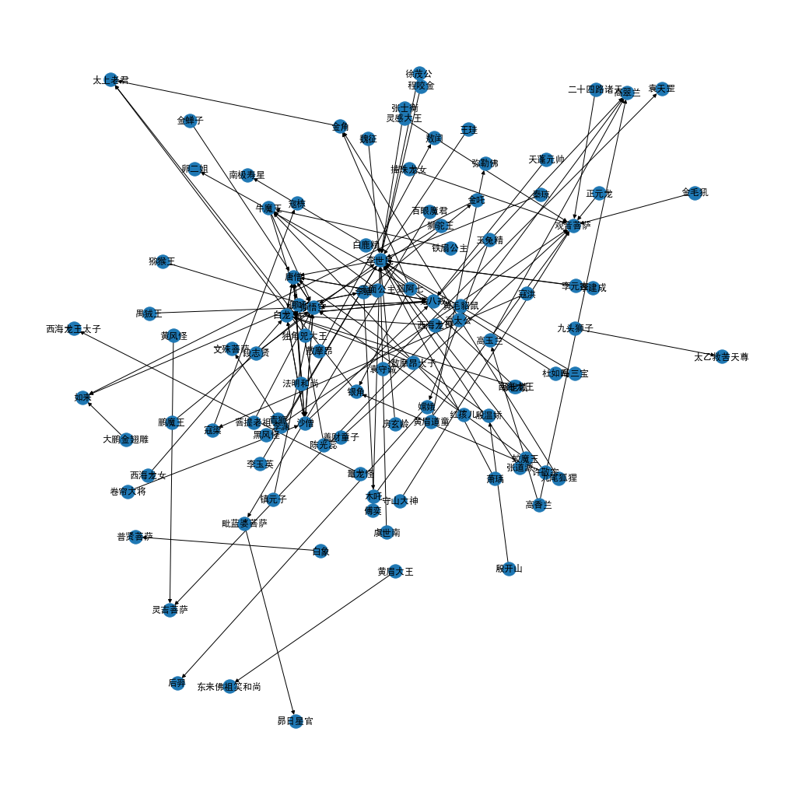
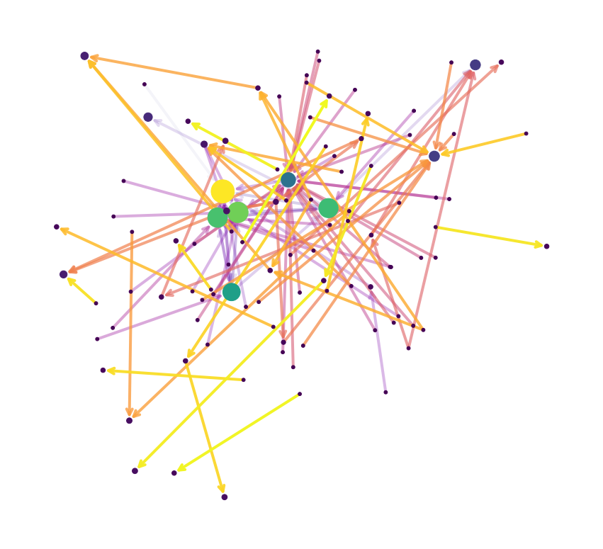

# PageRank

## PageRank 冷知识

* Google最早的搜索引擎算法，给每个网页重要度打分，高分靠前。
* 1997年之前的搜索引擎：网页收录少，相关率20%，排序效果差。
* 1997年之后，斯坦福大学Google搜索结果，相关率80%。
* 搜索引擎成为互联网第一个Killer App，开启互联网时代。

## PageRank简介

### Cool Idea

互联网的图表示

	* Web Pages表示为节点，Hyperlinks表示为连接。
	* 把互联网当做一个整体系统，网页之间存在关联，而不是孤立的个体。
 * 现在不太能这样表示了
   * 以前的网页是导航链接式网页
   * 现在的网页是交互式的，随时生成的；并且有大量无法触达的私域（例如微信）
 * 网页的重要度不都是一样的
   * 无标度网络呈现幂律分布

### 算法：Link Analysis Algorithm

使用连接信息来计算图节点重要度

把links视作votes，分为In-coming links（被其他网页引用）和out-going links（引用其他网页，需要剔除）

In-links的重要度也是不一样的，来自重要网页的in-link更重要。

递归问题：求网页的重要度->就要求网页in-links的重要度->其他网页的重要度->其他网页in-links的重要度->...

### 理解PageRank的五个角度

#### 迭代求解线性方程组

重要节点引出的稀少链接，权重更高。

​	假设网页 $i$的重要度为 $r_{i}$, 出度为 $d_{i}$, 则每一条链接的投票为 $\frac{r_{i}}{d_{i}}$；

​	网页 $j$的重要度为所有入度链接的投票值之和 $r_{j}=\sum_{i \rightarrow j} \frac{r_{i}}{d_{i}}$。

​	所有网页的重要度之和为1，即 $\sum_{j}r_{j} = 1$，即可用高斯消元法求解。

#### 迭代左乘M矩阵

将重要度写成矩阵的形式，左乘重要度矩阵

​	节点$i$的出度为$d_{i}$，如果$i$节点指向了$j$节点，那么$M_{j i}=\frac{1}{d_{i}}$；

​	$M_{j i}$矩阵（Stochastic adjacency matrix/ column stochastic matrix）每一列求和为1。

​	有$n$个节点，则$\vec{r}$是$n$维向量，每一个元素表示第$i$个节点。$\sum_{i} r_{i}=1$表示所有网页的PageRank值求和为1。

​	一次迭代：$\boldsymbol{r}=\boldsymbol{M} \cdot \boldsymbol{r}$

#### 矩阵的特征向量

由$1 \cdot r=M \cdot r$可得，$r$即是（column stochastic）矩阵$M$的特征向量。

通过不断地迭代左乘M矩阵（无限次），会稳定收敛，即得到M矩阵的主特征向量。

由Perreon-Frobenius定理，对于column stochastic矩阵，

​	最大的特征值为1；

​	存在唯一的主特征向量（特征值1对应的特征向量），向量所有元素求和为1。

#### 随机游走

在网页间随机游走，计数求和，归一化成概率，就是PageRank值。

​	假设在$t$时刻, 一个用户访问了多个网页 $i\left(i_{1}, i_{2}, \cdots\right)$；

​	在 $t+1$时刻, 访问到网页 $j$ 的概率为 $r_{j}=\sum_{i \rightarrow j} \frac{r_{i}}{d_{i}}$；

​	如果无限游走，$p(t)$可表示为网页$i$的概率，这个概率表示用户在$t$时刻访问网页$i$的PageRank值（所有概率求和为1）；

​	逐渐迭代, 可以稳定收敛, 即 $p(t+1)=M \cdot p(t)=p(t)$。

一个网页越容易被访问到，就证明这个网页越重要。

#### 马尔科夫链

每个节点表示一种状态，节点之间的连接表示状态的转移，根据状态转移矩阵，可以计算下一个时刻的状态转移概率。

求解PageRank，就等价于求解马尔科夫链的stationary distribution。

### 求解PageRank

* 迭代求解线性方程组（$O\left(n^{3}\right)$，不推荐）
* 迭代左乘$M$矩阵（推荐，幂迭代）
* 矩阵的特征向量（$O\left(n^{3}\right)$，不推荐）
* 随机游走（需模拟很多游走，不推荐）
* 马尔科夫链（和求解矩阵特征向量等价，不推荐）

#### 迭代左乘$M$矩阵

不断左乘$M$矩阵，收敛条件为
$$
\left(\sum_{i}\left|r_{i}^{t+1}-r_{i}^{t}\right|<\epsilon\right)
$$
计算网页的PageRank
$$
r_{j}^{(t+1)}=\sum_{i \rightarrow j} \frac{r_{i}^{(t)}}{d_{i}}
$$

##### 暴力破解法

Power iteration：

1. Initialize: $r^{(0)}=[1 / N, \cdots, 1 / N]^{T}$
2. Iterate: $r^{(t+1)}=M \cdot r^{(t)} \Longleftrightarrow r_{j}^{(t+1)}=\sum_{i \rightarrow j} \frac{r_{i}^{(t)}}{d_{i}}$
3. Stop when $\left|r^{(t+1)}-r^{(t)}\right|_{1}<\varepsilon$

### PageRank收敛性分析

是否能收敛至稳定值？

不同初始值，是否收敛至同一个结果？

收敛的结果在数学上是否有意义？

收敛的结果是否真的代表节点重要度？

#### Ergodic定理

如果满足irreducible（不可约的）和aperiodic（非周期震荡）的马尔科夫链，则一定满足：

1. 存在唯一稳定的解$\pi$
2. 所有的初始条件$\pi_{0}$收敛到同一个解$\pi$

 互联网满足irreducible和aperiodic的两个条件。

#### 一些问题

一些奇葩节点，dead ends（死胡同，没有out-links）和Spider traps（爬虫，out-links仅指向自己）

解决方案：
$$
r_{j}=\sum_{i \rightarrow j} \beta \frac{r_{i}}{d_{i}}+(1-\beta) \frac{1}{N}
$$
其中，$\beta$称为阻尼系数。

当概率为$\beta$时，正常随机游走；当概率为$1-\beta$时，有一定的概率随机传送到任何一个节点。

对于dead ends，设定百分百概率被传送走；对于Spider traps，有一定概率被传送走。

##### Google Matrix $G$

$$
G=\beta M+(1-\beta)\left[\frac{1}{N}\right]_{N \times N}
$$

### Proximity on graphs

寻找与指定节点最相似的节点。

基本假设：同一个用户访问过的节点更可能是相似的。

优化：将“随机传送到任一节点”优化为“随机传送到指定的一些节点”或“随机传送到指定的一个节点”，用访问次数来反映节点的亲疏远近。

Proximitv to querv node(s) $\boldsymbol{Q}$:

​	ALPHA = 0.5 # 传送概率

​	QUERY_NODES = {} # 指定节点集

​	$ item = QUERY NODES.sample by weight ()$

​	$for \ i \ in \ range( N_STEPS ):$ # 随机游走并计数

​		$user = item.get \ random \ neighbor( )$

​		$tem = user.get \ random \ neighbor( )$

​		$item.visit \ count +=1$

​	$if \ random( ) < ALPHA:$ # 随机传送

​		$item = QUERY NODES.sample.by \ weight ()$

### PageRank变种：

- Topic-Specific PageRank或Personalized PageRank：随机传送到指定的一些节点
- Random Walk with Restarts：随机传送到指定的一个节点

### 总结

1. 图可以表示为矩阵。
2. 可以用随机游走的方式去模拟。
3. 对应Stochastic adjacency矩阵$M$，每一列求和值为1。
4. PageRank就是求解之后稳定收敛后的解，对应Stochastic adjacency矩阵$M$的主特征向量。

## PageRank代码实战

西游记人物重要度

### 导入工具包


```python
import networkx as nx #图数据挖掘
import numpy as np 
import random 
import pandas as pd

# 数据可视化
import matplotlib
import matplotlib.pyplot as plt
import matplotlib as mpl
%matplotlib inline
matplotlib.rc("font",family='SimHei')
plt.rcParams['font.sans-serif']=['SimHei']  # 用来正常显示中文标签  
plt.rcParams['axes.unicode_minus']=False  # 用来正常显示负号
```

### 导入样例有向图数据集

OpenKG-四大名著人物关系知识图谊和OWL本体：http://www.openkg.cn/dataset/ch4masterpieces


```python
df = pd.read_csv('triples.csv')
```


```python
edges = [edge for edge in zip(df['head'], df['tail'])]

G = nx.DiGraph()
G.add_edges_from(edges)
```


```python
# 可视化
plt.figure(figsize=(14,14))
pos = nx.spring_layout(G, iterations=3, seed=5)
nx.draw(G, pos, with_labels=True)
plt.show()
```



    


### 计算每个节点PageRank重要度


```python
pagerank = nx.pagerank(
    G,                     # NetworkX graph 有向图，如果是无向图则自动转为双向有向图
    alpha=0.85,            # Damping Factor
    personalization=None,  # 是否开启Personalized PageRank，随机传送至指定节点集合的概率更高或更低
    max_iter=100,          # 最大迭代次数
    tol=1e-06,             # 判定收敛的误差
    nstart=None,           # 每个节点初始PageRank值      
    dangling=None,         # Dead End死胡同节点
)
```

### 按PageRank值从高到低排序


```python
pagerank_sorted_values = sorted(pagerank.items(),key=lambda x : x[1], reverse=True)
```


```python
pagerank_sorted_values[:4]
```


    [('唐僧', 0.13349105557884888),
     ('孙悟空', 0.10498354112014094),
     ('白龙马', 0.09531260474698808),
     ('猪八戒', 0.09247797536009736)]


### 用节点尺寸可视化PageRank值


```python
# 节点尺寸
node_sizes = (np.array(list(pagerank.values())) * 8000).astype(int)
```


```python
# 节点颜色
M = G.number_of_edges()
edge_colors = range(2, M + 2)
```


```python
plt.figure(figsize=(15,14))

# 绘制节点
nodes = nx.draw_networkx_nodes(G, pos, node_size=node_sizes, node_color=node_sizes)

# 绘制连接
edges = nx.draw_networkx_edges(
    G,
    pos,
    node_size=node_sizes,   # 节点尺寸
    arrowstyle="->",        # 箭头样式
    arrowsize=20,           # 箭头尺寸
    edge_color=edge_colors, # 连接颜色
    edge_cmap=plt.cm.plasma,# 连接配色方案，可选：plt.cm.Blues
    width=4                 # 连接线宽
)

# 设置每个连接的透明度
edge_alphas = [(5 + i) / (M + 4) for i in range(M)]
for i in range(M):
    edges[i].set_alpha(edge_alphas[i])

# # 图例
# pc = mpl.collections.PatchCollection(edges, cmap=cmap)
# pc.set_array(edge_colors)
# plt.colorbar(pc)

ax = plt.gca()
ax.set_axis_off()
plt.show()

```



    
